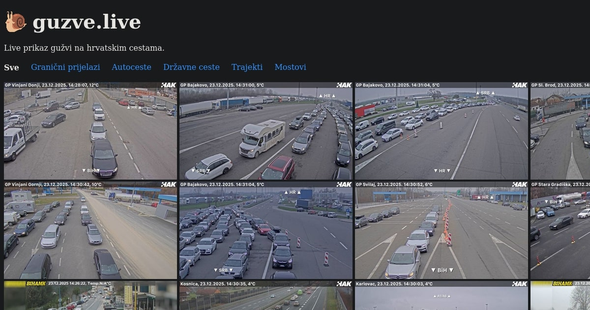

# guzve.live 🐌



Live traffic congestion dashboard for Croatian roads. Hourly snapshots from
HAK (Hrvatski autoklub) webcams, ranked by vehicle count detected with YOLO.

🌐 Live site: https://www.guzve.live

## How it works

`main.py`:
1. Fetches webcam metadata and images from the HAK API (`api.hak.hr`).
2. Runs YOLO11n object detection to count cars, buses, and trucks in each image.
3. Renders categorized static HTML pages with Jinja2, sorted by vehicle count.

## Tech stack

- Python 3.12, managed with [uv](https://docs.astral.sh/uv/)
- [ultralytics](https://github.com/ultralytics/ultralytics) YOLO11n + PyTorch (CPU)
- OpenCV for image decoding
- Jinja2 for HTML templating

## Development

```bash
uv sync
uv run main.py
```

Output is written to `build/`. Open `build/index.html` in a browser.

## Deployment

GitHub Actions (`.github/workflows/update.yml`) runs `main.py` every hour via
cron, commits the output to `docs/`, and deploys to GitHub Pages.
